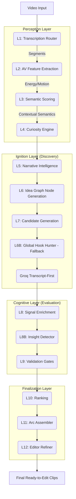

# 🎯 HotShort System Architecture (Staged Pipeline)

## Core Philosophy
The HotShort architecture has evolved from a monolithic scorer (V33) into a **12-Layer Staged Pipeline**.

The fundamental design principle is the **Tri-Layer Intelligence Model**:
1. **Local Discovery (Ignition)**: Fast, cheap local models (ParallelMind, Idea Graph) scan transcripts to find *candidate boundaries*.
2. **Cognitive Direction (Groq Cortex)**: An LLM acts as the Payoff Director, discovering complete narrative arcs (hook, build, payoff) from the raw transcript or evaluating existing candidates.
3. **Local Finishing (Arc Assembler)**: Local heuristics trim dead air, polish boundaries, ensure sentence completion, and format for the Editor Refiner.

---

## The 12-Layer Staged Pipeline



---

## Layer-by-Layer Breakdown

### L1: Transcription Router (`transcription_router.py`)
- Intelligently routes transcription tasks based on video duration, silence ratio, and segment count.
- **Engines**: 
  - `CPU Parallel` (Fast, cheap, int8)
  - `RunPod GPU` (Heavy lifting, float32, high concurrency)
- **Output**: Array of `{start, end, text, words}` segments.

### L2-L4: Perception (AV Features & Curiosity)
- **L2 AV Features**: Extracts audio energy spikes and visual motion metrics.
- **L3 Semantic Scoring**: Applies heuristic analysis (or Ultron Brain if loaded) to gauge semantic density.
- **L4 Curiosity Engine**: Maps curiosity loops across the video timeline, creating peaks where suspense or interest is highest.

### L5-L7: Ignition (Idea Graph & Candidate Gen)
- **L5 Narrative Intelligence**: Synthesizes perception signals into narrative markers (hooks, pattern breaks, payoffs).
- **L6 Idea Graph (`idea_graph.py`)**: 
  - Groups segments based on semantic boundaries rather than arbitrary time limits.
  - Generates structural "Idea Nodes".
- **L7 Candidate Generation (`optimized_passes.py`)**:
  - Turns Idea Nodes into candidate clips.
  - Applies a strict pass and a relaxed pass.
  - Passes candidates through an adaptive **Quality Gate**.

### L6B: Global Hook Hunter (`global_fields.py`)
- **Role**: *Rescue Path*.
- If the Idea Graph underflows (produces fewer candidates than the target minimum), the Hook Hunter scans the transcript for punchy hooks and backfills the candidate list.

### Groq Transcript-First (`groq_cortex.py`)
- **Role**: *Cognitive Payoff Director*.
- Reads 4-minute chunks of the raw transcript.
- Uses LLM intelligence to find complete arcs: **Hook → Build → Payoff**.
- Rejects clips that are incomplete or lack a payoff.
- Injects highly-scored, structurally sound clips directly into the pipeline.

### L8-L9: Enrichment & Validation
- **L8 Signal Enrichment**: Aggregates narrative, psychological, and semantic signals for all candidates.
- **L8B Insight Detector**: Flags candidates with high educational or practical value.
- **L9 Validation Gates (`validation_gates.py`)**: Hard filters that reject candidates based on minimum duration, maximum duration, or cripplingly low curiosity/semantic scores.

### L10: Ranking
- Evaluates the surviving candidates.
- Normalizes scores across different origins (Idea Graph vs Groq vs Hook Hunter).
- Selects the `Top K` diverse clips.

### L11: Arc Assembler (`orchestrator.py`)
- **Role**: *Boundary Polisher*.
- For local candidates: Scans forward from the hook to find the optimal `payoff_idx` and extends the clip to capture the full thought.
- **For Groq Candidates**: Trusts the LLM's boundaries.
- Trims dead air and extends by ~2-4s to ensure the final sentence is complete (`extend_until_sentence_complete`).

### L12: Editor Refiner (`world_class_editor.py`)
- Passes the final boundaries and editing notes (e.g., pacing, subtitle style, face priority) to the editor configuration payload.

---

## Intelligence Distribution

The system intentionally avoids monolithic decision-making. Different tools solve different problems:

| Tool / Layer | Responsibility | Strength |
| :--- | :--- | :--- |
| **Whisper VAD** | Clean text boundaries | Accuracy |
| **Idea Graph** | Semantic topic boundaries | Structural logic |
| **Hook Hunter** | Sudden excitement / questions | Attention capture |
| **Groq Cortex** | Narrative completeness & Payoff | Deep comprehension |
| **Arc Assembler** | Sentence completion & padding | Micro-timing |

### Data Model: The Pipeline Context (`PipelineContext`)
A single `ctx` object flows through the entire pipeline. It holds:
- `ctx.transcript` (Raw text)
- `ctx.idea_nodes` (Structural groups)
- `ctx.raw_candidates` (Ignition output)
- `ctx.enriched_candidates` (With scores)
- `ctx.final_candidates` (Ready for rendering)

## System Observability (X-Ray)

The pipeline is fully observable via `SystemObserver` (`system_observer.py`). At the end of every run, it prints an X-Ray Trace:

```text
============================================================
                 HOTSHORT PIPELINE X-RAY
============================================================
[STAGE AUTOPSIES]
⚡ CANDIDATE_GENERATION
   input=182 | output=4 | time=0.045s
⚡ GROQ_TRANSCRIPT_FIRST
   input=12 | output=2 | time=4.200s
...
```
This telemetry ensures no layer silently drops clips and allows precise tuning of quality gates.
